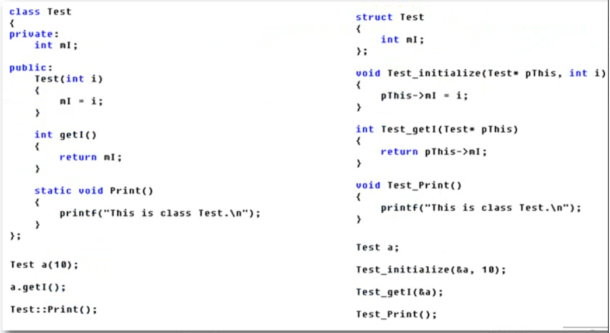

# C++基础

> 关于C++基础部分的文件目录

## 目录

> C++对C的扩展
- [HelloWorld](#HelloWorld)
- [C++对C的加强](#C++对C的加强)
- [C和C++中的const](#C和C++中的const)
- [引用](#引用)
- [C++对C的函数扩展](#C++对C的函数扩展)

> 面向对象基础
- [类的封装](#类的封装)
- [构造函数和析构函数](#构造函数和析构函数)
- [数组类的设计实现](#数组类的设计实现)
- [友元函数](#友元函数)
- [运算符重载](#运算符重载)
- [字符串类的实现](#字符串类的实现)
- [继承](#继承)
- [多态](#多态)

## HelloWorld

- [C++ HelloWold 代码。](00_Helloword/00_Hello.cpp)
  - （有句话说的好，从HelloWorld到放弃）

## C++对C的加强

- [命名空间和iostream](01_namespace/00_namespace.cpp)
- [“实用性”增强](01_namespace/01_C++对C实用性增强.cpp)
  - C中定义必须在执行语句前，C++可以在任何位置
- [register关键字加强](01_namespace/02_register关键字的扩展.cpp)
  - C中不能对register取地址，C不对语句进行优化，C++可以对register取地址，且对语句做优化以加快执行速度
- [变量检测增强](01_namespace/03_变量检测增强.cpp)
  - C可以定义两个同名变量不报错，C++会报错
- [struct功能增强](01_namespace/04_struct功能增强.cpp)
  - C语言中认为struct定义了一组变量的集合，C++认为struct定义了一个性类型。
  - C++中对struct和class进行的操作是一样的,也有区别
- [变量和函数类型检测增强](01_namespace/05_变量_函数类型检查增强.cpp)
  - c++中函数必须有返回值类型，C语言可以没有，会有默认值‘
  - C++函数参数必须有类型，C语言可以没有。
- [新增bool类型](01_namespace/06_新增bool类型.cpp)
- [三目运算符](01_namespace/07_三目运算符.cpp)
  - C语言中表达式不能直接做左值，C++中可以

## C和C++中的const

- [C和C++中对const的实现](02_C语言和C++中的const/00_C和C++中const的实现.cpp)
  - C语言中const可以通过指针修改，C++中不能修改
  - C语言只是增加了一个不能修改的属性
  - C++放在了符号表中，不能以任何方式修改
- [C++中const和#define的异同](02_C语言和C++中的const/00_C和C++中const的实现.cpp)
  - 相同点
    - 可以用const替代#define使用
  - 不同点
    - const 由编译器提供处理，有变量检查和作用域
    - #define 由预处理器处理，只实现文本处理功能

## 引用
- [引用基础知识](03_引用/00_引用基础知识.cpp)
  - 已定义变量的别名
  - 语法：  TYPE& name = var;
  - 普通引用必须初始化，引用做函数参数不用初始化
  - 复杂类型的引用举例(struct)
  - C++中引用代替zhizhen？部分场合吧，引用可读性好
- [引用的本质](03_引用/01_引用的本质.cpp)
  - 引用本质： TYPE * cosnt var; // 必须初始化且占用一个指针的内存空间
  - 引用就是间接赋值的1-23模型
  - 引用使用时不必关注本质，分析语法现象时才考虑其常量指针的本质
- [函数返回值为引用(引用做左值或右值)](03_引用/02_函数返回值为引用(做左值右值).cpp)
  - 做右值时，临时堆栈变量不能使用函数返回引用初始化引用
  - 静态变量或全局变量可以使用函数返回引用初始化引用(既可以做左值也可以做右值)
  - 做左值时，函数返回被引用变量本身，可以做左值(必须是静态变量或者全局变量)
- [指针的引用](03_引用/03_指针的引用.cpp)
  - TYPE* &VarName
- [const引用](03_引用/04_const引用.cpp)
  - const 修饰变量引用, 给变量设置只读属性
  -  const 修饰常量（字面量）引用`const int& c = 50; `

## C++对C的函数扩展

- [inline内联函数](04_C++对C的函数扩展/00_inline内联函数.cpp)
  - 内联函数在编译时直接将函数体插入到函数调用地方
  - inline只是一种请求，编译器不一定允许这种操作
  - 内联函数省去了普通函数压栈、跳转和返回的开销
- [函数的默认参数](04_C++对C的函数扩展/01_函数的默认参数.cpp)
  - 函数的默认参数可以不传递，不传递则使用默认值
  - 默认参数必须放在非默认参数后面
- [函数的占位参数](04_C++对C的函数扩展/01_函数的默认参数.cpp)
  - 必须传递占位参数
- [函数的默认参数和占位参数](04_C++对C的函数扩展/01_函数的默认参数.cpp)
  - 可传递可不传递
  - 为以后业务开发留下线索？？
- [重载函数](04_C++对C的函数扩展/02_函数重载.cpp)
  - 函数名相同，参数不一样（类型和个数均不一样）,函数返回值的异同不能作为函数重载的判断依据
  - 重载函数本质上是相互独立的不同函数（静态链编）
  - 当重载遇上默认函数时，要注意去掉默认参数后参数类型和个数不能和已有重载函数相同，否则调用时可能会遇到重载不匹配
  - 重载函数与指针函数

## 类的封装

- [类的封装](05_面向对象基础/00_类的封装.cpp)
  - 对成员函数和成员属性进行封装
  - 对成员函数和成员属性进行访问控制
  - class 默认定义的属性是 private 在类外部不可见
  - struct 默认定义的属性是 public 在结构体外部可见
- [类的声明和定义分开实现](05_面向对象基础/01_类的声明和实现分开.cpp)
- 面向过程向面向对象转变案例
  - [立方体](05_面向对象基础/02_面向过程向面向对象转变案例立方体.cpp)
  - [圆点模型](05_面向对象基础/03_点圆模型.cpp)
  - [圆点模型2](05_面向对象基础/04_点圆模型2.cpp)

## 构造函数和析构函数

- [构造函数和析构函数](06_构造函数和析构函数/00_构造函数和析构函数.cpp)
- [构造函数的分类](06_构造函数和析构函数/01_构造函数的调用.cpp)
  - 无参构造函数
  - 有参构造函数
  - 默认构造函数
  - 默认赋值(copy)构造函数
- [构造函数的调用方法](06_构造函数和析构函数/01_构造函数的调用.cpp)
  - 无参构造函数的调用
    - Test t;    //定义即调用 
  - 有参构造函数的调用
    - Test t1(1, 2);
    - Test t3 = (1, 2);
    - Test t4 = Test(2); 
- [赋值(copy)构造函数的调用](06_构造函数和析构函数/02_赋值(copy)构造函数的调用.cpp)
  - Test t3 = t1;
  - Test t4(t1);
  - copyInit3(t2); 
  - Test copyInit4() ;// 返回类对象时， C++会提前创建一个匿名对象作为返回值,调用构造函数
- [构造函数的调用规则](06_构造函数和析构函数/03_构造函数调用规则.cpp)
  - 在定义类时，C++编译器自动提供无参构造函数和无参析构函数
  - 若定义有参构造函数，则C++编译器不提供无参构造函数
  - 若定义赋值(复制|copy),则C++编译器不提供无参构造函数
  - ！！！只要自定义构造函数，就必须使用，C++编译器不在提供默认构造函数
- [深拷贝和浅拷贝](06_构造函数和析构函数/04_深拷贝和浅拷贝.cpp)
  - 成员函数有指针，需要在堆上分配内存的，C++默认的赋值构造函数浅拷贝，可以通过重写拷贝构造函数进行深拷贝。
  - 成员函数有指针，需要在堆上分配内存的，等号造作赋值时浅拷贝，等号造作符重载？？？
- [构造函数的初始化列表](06_构造函数和析构函数/05_构造函数初始化列表.cpp)
  - 类B的成员变量中有类A的组合，定义时使用构造函数的初始化列表
    - 语法：Constructor::Constructor():m1(v1),m2(v1,v2),m3(v3)
  - 执行顺序：
    - 定义B类时，先调用A类的构造函数，后调用B类的构造函数
      - 包含多个A类时，按照定义顺序调用构造函数完成构造，与初始化列表的顺序无关
    - 析构函数的调用按顺序相反
  - const 成员变量必须使用构造函数初始化列表初始化
  - 匿名对象的生命周期
- [new和delete的基础语法](06_构造函数和析构函数/06_new和delete的基本语法.cpp)
  - malloc 类对象时，只分配内存，不调用构造函数初始化
  - new    类对象时，分配内存并调用构造函数初始化
  - free   类对象时，只释放内存
  - delete 类对象时，释放内存并调用析构函数销毁类对象
- [static关键字](06_构造函数和析构函数/07_static关键字.cpp)
  - 所有对象共用一个静态属性，静态属性声明后必须使用`TYPE ClassName::StaticVar = Value`在函数外部定义
  - 静态方法中不能使用普通成员函数，只能使用静态成员函数
  - 静态方法调用：`ClassName::StaticVoid()`和`ObjName.StaticVoid()`
- [面向对象模型初探](06_构造函数和析构函数/08_面向对象模型初探.cpp)
  - 成员变量和成员函数分开存储
  - 普通成员变量的实现和struct一致

- [this指针](06_构造函数和析构函数/09_面向对象this指针.cpp)
- [成员函数const](06_构造函数和析构函数/09_面向对象this指针.cpp)
  - const 修饰成员函数时，本质上修饰this指针，即this指针所指内存空间不能被修改
  - void ConstPrint(const Test* const thisint a, int b)

## 数组类的设计实现

- [数组类的设计和实现](07_数组类的设计和实现/00_TestArray.cpp)
  - [头文件](07_数组类的设计和实现/00_Array.h)
  - [cpp文件](07_数组类的设计和实现/00_Array.cpp)

## 友元函数

- [友元函数](08_友元函数和友元类/00_友元函数.cpp)
  - 友元函数是类的好朋友，能访问类的私有变量
  - 友元函数在类中声明的位置没有意义
- [友元类](08_友元函数和友元类/00_友元函数.cpp)
  - 友元类一般用在数据操作或者类之间消息辅助传递

## 运算符重载

- [运算符重载基础](09_运算符重载/00_运算符重载.cpp)
  - 为实现自定义数据类型使用操作符进行运算符重载
  - 运算符重载本质是函数调用
- [二元操作符重载](09_运算符重载/01_二元运算符重载.cpp)
  - 操作符重载函数的确定：
    - 1 确定函数名， operator重载运算符()
    - 2 确定参数：运算符运算对象
    - 3 确定返回值： 根据实际需要确定
- [一元操作符重载](09_运算符重载/02_一元操作符的重载.cpp)
  - 重载 前置++ 操作符,友元函数`friend Complex& operator++(Complex& z1);`
  - 重载 前置-- 操作符,成员函数`Complex& operator--()`
	- 重载 后置++ 操作符,友元函数`friend Complex operator++(Complex& z1, int);`
  - 重载 后置-- 操作符,成员函数`Complex operator--(int)`
  - 成员函数实现重载多用于相同类之间使用操作符的场景
- [左移右移操作符重载](09_运算符重载/03_左移右移操作符重载.cpp)
  - `cout << z1;`重载`ostream& operator<<(ostream& out, Complex& z1)`
  - `cin >> z1;`重载`istream& operator>>(istream& in, Complex& z1)`
  - 友元函数实现重载多用于不同类之间使用操作符的场景
- [等号操作符重载](09_运算符重载/04_重载等号操作符.cpp)
  - `s3 = s4 = s1;`等号重载`Student &operator=(Student & s1);`
  - 释放旧资源后再赋新值
  - 返回一个引用，满足链式编程
- [数组类优化](09_运算符重载/05_TestArray.cpp)
  - 重载中括号\[\]`int& operator`
  - 重载等号操作符 = `Array& operator=(Array& IntArray)`
  - 重载等号操作符 == `bool operator==(Array &IntArray3)`
  - 重载不等号操作符 != `bool operator!=(Array& IntArray3)`
  - 重载左移操作符 << `ostream& operator<<(ostream& out, Array& IntArray)`
  - 重载右移操作符 >>`istream&  operator>>(istream& in, Array& IntArray)`
  - 重载括号运算符()`void operator()(int& PrintLen)`
  - 不能重载`&&`和`||`运算符，这两个运算符具有短路机制(若左值不符合要求则不计算右值)，C++操作符重载由函数实现，而函数无法实现短路机制。(结论:可以重载但无法实现短路规则)

## 字符串类的实现

- [基本操作符的重载](String/00_TestString.cpp)

## 继承

- [继承基本语法](11_继承/00_继承的基本语法.cpp)
  
- `class Student :public People`
  
- [继承中的访问控制](11_继承/01_继承中的访问控制.cpp)
  - public     : 公共成员-类的内部和类的外部均可访问
  
  - protected  : 受保护的成员-类的内部和派生类可访问
  
  - private    : 私有成员-类的内部可访问，外部不能访问
  
- 子类对外的访问控制：
  
  - |           | public    | protected | private |
    | --------- | --------- | --------- | ------- |
    | public    | public    | protected | private |
    | protected | protected | protected | private |
    | private   | private   | private   | private |

- [派生类中访问控制结论](11_继承/01_继承中的访问控制.cpp)
  - 一般都用`public`继承
  - 需要子类访问的用`protected`
  - 不需要子类访问的用`private`

- [继承中的兼容性](11_继承/02_继承的兼容性原则.cpp)
  - 赋值兼容
    - 基类指针赋值子类对象
    - 基类引用赋值子类对象
    - 基类对象赋值给子类(ERRO)
  - 子类对象copy构造基类对象
- [继承和组合中的构造与析构](11_继承/03_继承中的构造和析构.cpp)
  - 先调用继承的构造函数、后调用组合的构造函数、最后调用自己的构造函数
  - 调用继承构造函数的时候，按继承顺序，从父类调用到子类
  - 调用组合构造函数时，按组合类在本类中的定义顺序调用
  - 析构函数与构造函数的调用顺序相反

- [继承中同名属性和方法](11_继承/04_继承中的同名属性和方法.cpp)
  - 默认使用子类属性和方法
  - 可以使用域名限制明确要的属性和方法`t1.Test1::b = 20;`

- [继承中的static关键字](11_继承/05_继承中的static关键字.cpp) 
  - 父类中的static变量和方法仍遵循类的访问控制原则
  - static属性和方法一定要初始化，关系到内存分配、
  - 类方法的默认属性时private，不能被类外部访问！！类方法定义成public属性
- [多继承的基本语法](11_继承/06_多继承的基本语法.cpp)
  - `class Test:public Test1, public Test2`

- [多继承的二义性和虚继承](11_继承/07_二义性和虚函数.cpp)
  - 多继承结构图成图状时，属性具有二义性
  - `virtual`关键字定义虚继承可以避免二义性
  - `virtual`通过只调用一次具有二义性的属性的类的构造函数实现避免二义性

## 多态

- [兼容性原则和函数写](12_多态/00_类型兼容性原则和函数重写.cpp)
  - 可以让不同时代的关系类调用并使用相应的函数。同一种写法，不同的表现形式？？
  - 多态是留给未来(子类)的接口
  - `virtual` 表明是多态，子类中 `virtual` 可写可不写 。写了醒目，是多态

- [多态的意义和条件](12_多态/01_多态的意义和条件.cpp)
  - 封装：突破C语言函数的概念，类的对象可以使用类的属性和方法
  - 继承：a<-b, b可以使用a的代码，代码复用原则
  - 多态：为未来的代码编写框架，写给未来的
  - 实现多态的条件
    - 要有继承
    - 虚函数重写
    - 用父类指针(父类引用)指向子类
  - 不写 virtual 是静态联编，C++在编译的时候根据定义的类调用函数
  - 写 virtual 是动态联编：迟绑定(C++根据不同的对象选择函数执行)
  
- [虚析构函数](12_多态/02_虚析构函数.cpp)
  - 使用 virtual 调用父类释放函数，使父类指针释放所有子类资源
  - 不使用 virtual 调用父类释放函数，只释放父类资源

- [重载&重写&重定义](12_多态/03_重载a重写n重定义d.cpp)
  - 函数重载
    - 在同一个类中的同名函数
    - 子类无法重载父类函数，父类中同名函数将被覆盖(可以通过域作用符调用)
    - 重载是由编译器编译过程中静态的由参数确定
  - 函数重写
    - 子类与父类中的同名函数
    - 子类与父类中的函数必须具有相同的原型
  - 函数重写分两类
    - 写了virtual的函数为虚函数重写，发生多态
    - 没写virtual的函数为函数重定义，调用父类

- [多态原理](12_多态/04_多态原理.cpp)
  - 当类中声明虚函数的时候， C++编译器会在类中维护一个虚函数表
  - 虚函数表是一个存储对应类虚函数指针的数据结构
  - virtual 关键字修饰的成员函数会被放入虚函数表中
  - 存在虚函数时，每一个类对象中都有一个指向虚函数表的指针(vptr指针)
  - [vptr指针存在](12_多态/05_vptr指针的存在.cpp)

- [vptr指针的分步初始化](12_多态/06_vptr指针的分步初始化.cpp)
  -  当执行父类构造函数的时候，b 的 vptr 指针指向父类的虚函数表
	-  父类构造函数执行完毕后，b 的 vptr 指针指向子类的虚函数表
	- 结论：构造函数中调用虚函数，只会执行本类虚函数表中函数

- [子类指针与父类指针的步长](12_多态/07_子类指针步长和父类指针步长不一样.cpp)
  - 指针的步长与指针的类型有关
	- 当子类与父类所占内存空间大小不一样的时候，两种指针步长大小不一样

