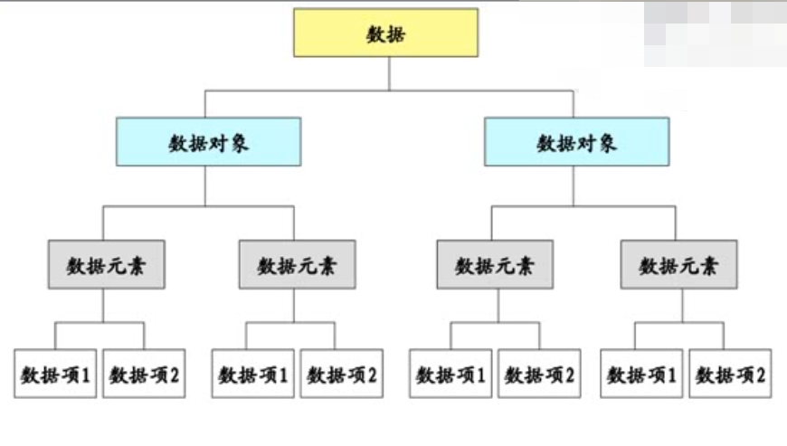
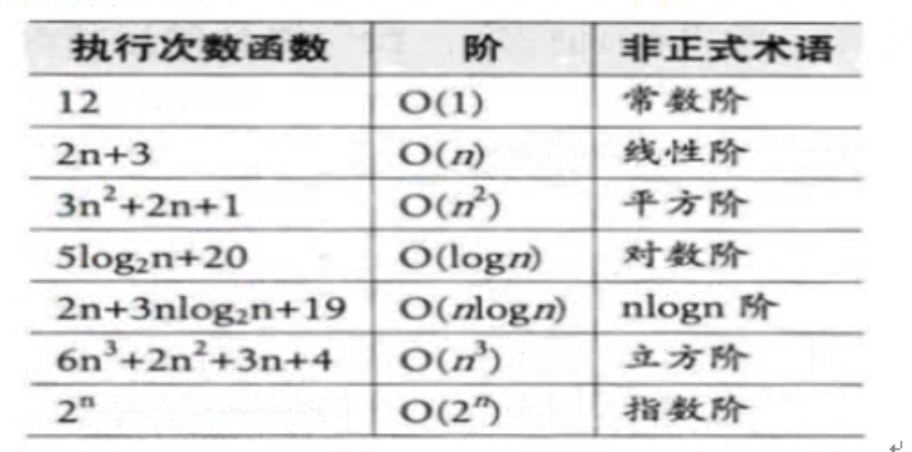
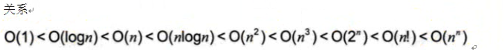

# C&C++数据结构

> 关于C&C++数据结构的文件目录

## 目录

- [数据结构实用概念](#数据结构实用概念)
- [算法实用概念](#算法实用概念)
- [线性表](##线性表)

## 数据结构实用概念

- 数据结构基本概念
  - 数据：程序的对象，用于描述客观事物
  - 数据对象：性质相同数据元素的集合(比如数组、链表)
  - 数据元素：组成数据的基本单位(如结点)
  - 数据项：一个数据元素由若干个数据项组成(如类成员)
  - 数据结构：数据元素之间的关系

- 数据的逻辑结构和物理结构
  - 逻辑结构：
    - 集合：结点同属于一个集合
    - 线性结构：1:1
    - 树形结构：1:N
    - 图状结构：N:N
  - 物理结构：
    - 顺序
    - 链式
    - 索引
    - 散列

## 算法实用概念

- 算法基本概念
  - 对特定问题求解步骤的描述(语言不重要，思想才重要)
  - 算法和数据结构的区别：
    - 数据结构静态的描述了数据元素之间的关系
    - 算法使用数据结构解决特定问题
    - 程序 = 算法 + 数据结构
  - 算法特性：
    - 输入：一个或多个
    - 输出：一个或多个
    - 有穷性：有限步骤完成
    - 确定性：每一步确定没有二义性
    - 可行性：算法每一步都可行
  
  - 算法度量：
    - 时间复杂度->[大O表示法](00_数据结构和算法基本概念/00_大O表示法.cpp)
      - 
      - 
    - 空间复杂度
      - [时间换空间案例](00_数据结构和算法基本概念/01_时间换空间案例.cpp)
  
## 线性表

- [顺序存线性表](01_线性表/00_线性表顺序存储.c)
  - 实现顺序存储线性表API模型
